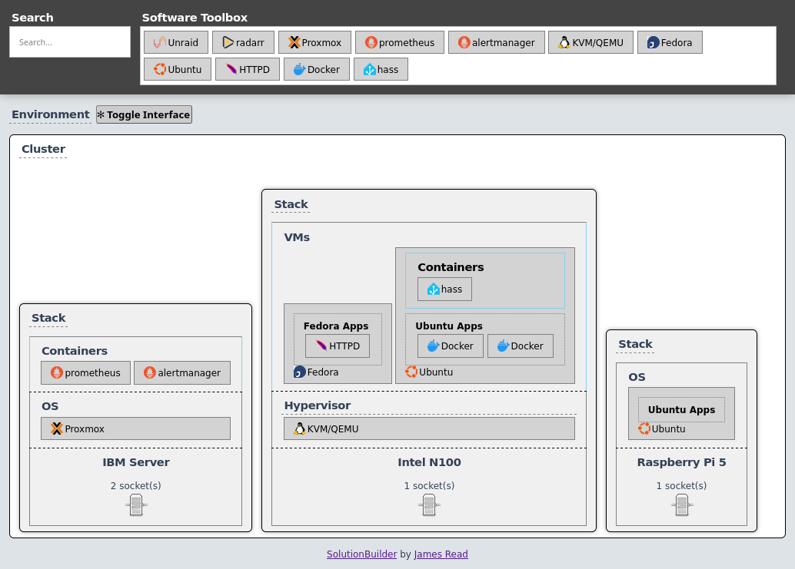

  
  <h1>Vitae</h1>
  (recently renamed from SolutionBuilder)

The lifecycle tool for your software. Plan, Visualize, Document, Integrate, and Replace. 

# Screenshots 

Playing around with some ideas. This was a project I developed back in about 2012, and I've recently just added some new apps as it might be useful for people's homelabs. 

# Use cases

1. **Plan** your deployment - does it have an IP address, a vlan, which host will it be deployed to. What are the problems I hope this deployment will solve? 

1. **Visualize** - how the software relates to hardware, clusters, stacks, VMs, Containers, and their relationships, all without having to draw boxes. Click and browse a
2.  built-in database of self hosted software.
   1. Future idea: scan your network, or docker.sock, and build the diagram automatically.
   2. Future idea: "Enhance" - zoom in on portions of the diagram to show a single server, or single docker network.
   3. Future idea: easily toggle areas of the diagram, like VLANS, IP Addresses, etc.
   4. Future idea: export as PNG, SVG, etc
     
3. **Document** the various parts of your infrastructure. Pull in notes in any markdown format. Prompts you to add the "why" to the "what". Why are we using Fedora here, or KVM, or Proxmox? Add those notes.
   1. eg: How is this part of the infrastrucutre backed up?
   2. eg: How is this part of the infrastructure authenticated?
   3. eg: Does this part of the infrastructure rely on an unstable release?
      
5. **Integrate** - suggests popular integration points 
   1. Future idea: eg: App A has a plugin for the App B you are using.
   2. Future idea: eg: App A and App B both support OIDC.

6. **Replace** - from your requirements, explore alternatives and replacments. 
   1. Future idea: Easily browse alternatives for a Load Balancer, that meet your requirements (eg, like a selfhosted AlternativeTo.net).
